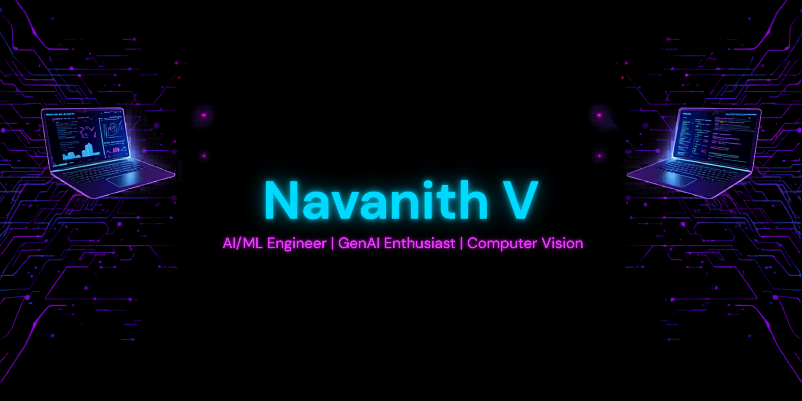

  

<h1 align="center">Hi 👋, I'm Navanith V</h1>
<h3 align="center">AI/ML Engineer | Computer Vision | GenAI Enthusiast</h3>

---

## 🚀 About Me

- 🎓 AIML Undergraduate
- 🤖 Interested in AI, ML, Deep Learning & GenAI
- 🌱 Currently learning LLMs and RAG
- 💡 Building AI Projects
- 📫 Reach me: navanithworkofficial@gmail.com

---

## 🌐 Connect With Me

<h3>LinkedIn</h3>

  

<h3>Instagram</h3>

---

## 🛠️ Tech Stack

---

## 📌 Featured Projects

### 🐾 TrapSense AI
Wildlife monitoring using Computer Vision and YOLOv8.

### 🛡️ Guardian AI
Real-time threat detection system using Whisper + NLP.

---

## 📊 GitHub Stats

---

## 🏆 GitHub Achievements

---

## 🔥 Contribution Graph

---

<h3 align="center">✨ "Building the future with AI" ✨</h3>
